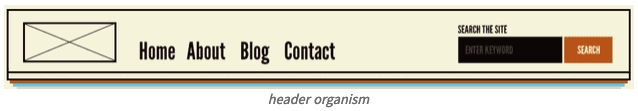

# 1. Design System

* 반응형 웹 디자인(Responsive web design)
* 디자인 시스템(Design System)
* Atomic Design

## 1. 디자인 시스템 (Design System)

서로 다른 페이지와 채널에서 공유 언어와 시각적 일관성을 유지하면서 중복을 줄임으로써 설계를 규모에 맞게 관리하기 위한 일련의 표준이다.

디자인 시스템은 **재사용 가능한 구성 요소 및 패턴을 사용**하여 규모에 맞게 설계를 관리하기 위한 완전한 표준 세트입니다

Theme, Components의 개념을 활용할 수 있다.

### 디자인 시스템을 사용하는 이유

* 디자인 작업을 대규모로 신속하게 작업하고 복제할 수 있다.
* 더 크고 복잡한 문제에 집중할 수 있도록 설계 리소스에 대한 부담을 덜어준다.
* 교차 기능 팀 내에서 또는 팀 간에 통합된 언어를 생성한다.
* 제품, 채널 및 부서 간 시각적 일관성을 준다.
* 주니어 레벨 디자이너와 콘텐츠 기고자를 위한 교육 도구 및 참조 역할을 할 수 있다.&#x20;

### 사용 사례

* [Atlassian Design System](https://atlassian.design/)
* [Material Design (Google)](https://material.io/)
* [Base Web (Uber)](https://baseweb.design/)
* [Polaris (Shopify)](https://polaris.shopify.com/)
* [Lightning Design System (Salesforce)](https://www.lightningdesignsystem.com/)
* [Mailchimp Pattern Library](https://ux.mailchimp.com/patterns)
* [Ant Design](https://ant.design/)

## 2. 반응형 웹 디자인

사이트가 보여지는 장치의 요구와 기능에 대응하도록 제작

### 뷰포트 설정

다양한 장치에 최적화 된 페이지는 문서 헤드에 메타 뷰포트 태그를 포함해야 한다. 메타 뷰포트 태그는 페이지의 크기와 배열을 제어하는 방법에 대한 정보를 브라우저에 제공한다.

메타 뷰포트 값 `width=device-width`를 사용하면 장치 독립적인 픽셀로 화면 너비를 일치시킬 것을 페이지에 알려준다.

```html
<!DOCTYPE html>
<html lang="en">
  <head>
    …
    <meta name="viewport" content="width=device-width, initial-scale=1">
    …
  </head>
  …
```

`initial-scale=1`을 추가하면 브라우저가 장치 방향에 관계없이 CSS 픽셀과 장치의 픽셀 사이에 1:1 관계를 유지하도록 지시하고 페이지에서 전체 가로 너비를 활용할 수 있다.

## 3. Atomic Design

brad frost의 [아토믹 디자인](https://atomicdesign.bradfrost.com/chapter-2/) 은 화학적 관점에서 영감을 얻은 디자인 시스템이다. 모든 것은 atom(원자)으로 구성되어있고 atom(원자)들이 서로 결합하여 molecule(분자)이 되고, molecule는 더 복잡한 organism(유기체)으로 결합하여 궁극적으로 모든 물질을 생성하게된다. 아토믹 디자인에서는 이 개념을 차용해 컴포넌트를 atom, molecule, organism, template, page의 5가지 레벨로 나누고 있다.

단계별로 추상적인 것에서 구체화하는 단계를 거치고, 이 과정을 통해 일관성을 갖지고 확장하면서 최종 콘텐츠를 보여줄 수 있다.

<figure><figcaption></figcaption></figure>

> <mark style="background-color:blue;">**디자인 시스템과 아토믹 디자인**</mark>\
> brad frost에 따르면 디자인 시스템은 어떤 조직이 디지털 인터페이스를 디자인하고 구축하는 방식에 대한 이야기라고 말한다. 디자인 시스템은 여러가지 하위 시스템을 포함하는데, UI 컴포넌트와 variants, 타이포그래피 시스템, 컬러 팔레트 시스템, 레이아웃 / 그리드 시스템 등이 있, 아토믹 디자인은 디자인 시스템을 만드는 방법론이다.&#x20;

### ATOMS(원자)

atom은 input, label, button 등의 HTML 태그로 더이상 분해할 수 없는 기본 컴포넌트이다. atom은 모든 기본 스타일을 한눈에 보여주기때문에 디자인 시스템을 개발할 때 유용하게 사용된다. atom은 추상적인 개념도 표현할 수 있는데 이것은 단일 컴포넌트로 사용하기는 어려움이 있고, 다른 atom과 결합하거나 molecule, organism 에서 여러 단위와 결합하여 유용하게 사용할 수 있다.

<figure><figcaption></figcaption></figure>

### MOLECULES(분자)

Molecules은 여러 개의 atom을 결합하여 자신의 고유한 특성을 가진다. atom들을 결합할 경우 button(atom)을 클릭하여 form을 전송하는 molecule로 정의할 수 있다. molecules는 한 가지 일을 한다. SRP원칙으로 인해 키워드 전송이 필요한 곳에서 재사용될 수 있다. molecule의 SRP는 재사용성과 UI에서의 일관성, 테스트하기 쉬운 조건이라는 이점이 있다.

<figure><figcaption></figcaption></figure>

### ORGANISM

organism은 앞 단계보다 더 복잡하고 서비스에서 표현될 수 있는 명확한 영역과 특정 컨텍스트를 가진다. atom, molecule, organism으로 구성할 수 있다. 상대적으로 재사용성이 낮아질 수 있다.

<figure><figcaption></figcaption></figure>

* ex: header라는 컨텍스트에 Logo(atom), navigation(molecule), search form(molecule)가 있는 형태

### TEMPLATES

template은 page를 만들 수 있도록 여러 개의 organism, Molecule로 구성할 수 있다. 실제 컴포넌트를 레이아웃에 배치하고 구조를 잡는 와이어프레임이다. 즉, 실제 콘텐츠가 없는 page 수준의 스켈레톤으로 정의할 수 있다.

<figure><figcaption></figcaption></figure>

### PAGES

page는 유저가 볼 수 있는 실제 콘텐츠를 담고 있고, template의 인스턴스라고 할 수 있다.&#x20;

<figure><figcaption></figcaption></figure>

* ex: 장바구니에 유저가 담은 상품이 없는 경우(template1), 유저가 담은 상품이 있는 경우(template2)


